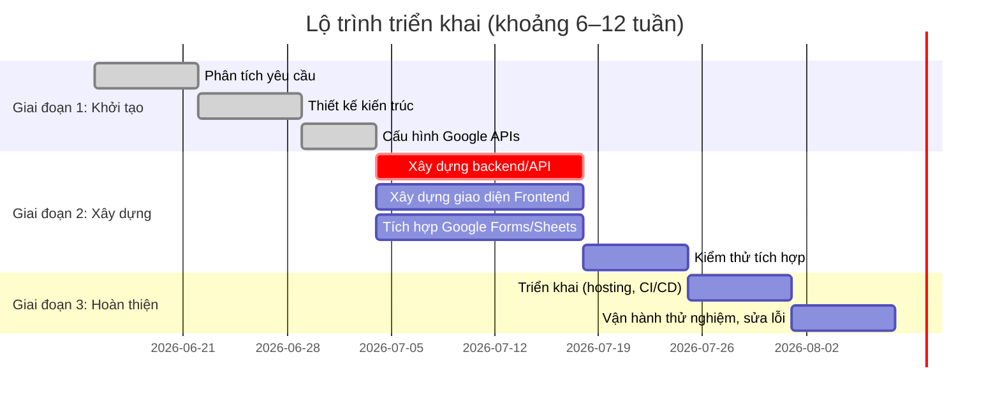

# Tóm tắt điều hành  
Hệ thống ôn thi trắc nghiệm tích hợp Google Form/Sheet và website được thiết kế để giáo viên dễ dàng nhập đề thi (câu hỏi và đáp án) qua Google Forms hoặc Google Sheets, đồng bộ tự động lên website giao diện thi cho học sinh làm trực tuyến, sau đó hệ thống sẽ chấm bài tự động, lưu điểm và nhật ký chi tiết vào Google Sheet, đồng thời quản lý người dùng (giáo viên, học sinh), phân quyền, lịch sử làm bài và báo cáo kết quả. Mô hình đề xuất sử dụng kiến trúc backend phục vụ API với cơ sở dữ liệu lưu trữ (ví dụ MySQL, Firebase), frontend web (React/Vue hoặc HTML/JS thuần) hiển thị giao diện thi như yêu cầu. Hệ thống dùng **Google Forms API** và **Google Sheets API** để đồng bộ dữ liệu; hoặc tùy chọn tích hợp qua **Apps Script**. Toàn bộ giao tiếp với Google tuân thủ **OAuth2** để bảo mật và sử dụng các scopes phù hợp (ví dụ `forms.body`, `spreadsheets`). Cơ sở hạ tầng có thể triển khai trên cloud (Google Cloud/AWS), với backup định kỳ và cân nhắc tuân thủ luật bảo vệ dữ liệu cá nhân (GDPR/NĐ13/2023…).  

## Phân tích chức năng và nghiệp vụ  
- **Nhập đề – Duyệt và phát hành đề**: Giáo viên tạo đề thi gồm tiêu đề, mô tả, thời gian làm bài, câu hỏi trắc nghiệm (MCQ), đáp án, cùng tài liệu kèm theo (hình ảnh, công thức LaTeX). Có thể nhập đề trực tiếp qua Google Form (có thể dùng trường “Tiêu đề câu hỏi”, “Các lựa chọn”, đánh dấu đáp án đúng) hoặc nhập lên Google Sheet định dạng sẵn (mỗi hàng là một câu hỏi, cột chứa câu, lựa chọn, đáp án, đường dẫn ảnh/công thức). Sau khi nhập, giáo viên duyệt lại và phát hành đề; đặt thời gian mở/đóng thi.  
- **Luồng thi và chấm tự động**: Học sinh đăng nhập (qua tài khoản Google hoặc hệ thống nội bộ), chọn đề thi đang mở. Hệ thống hiển thị câu hỏi theo giao diện web như ảnh mẫu (có thể sử dụng thư viện MathJax/KaTeX để render công thức LaTeX, hiển thị ảnh nếu có). Câu hỏi và đáp án có thể được xáo trộn ngẫu nhiên nhằm hạn chế gian lận. Hệ thống giới hạn thời gian thi (đếm ngược hiển thị) và cho nộp bài cuối thời gian. Khi học sinh nộp, backend so sánh đáp án với đáp án đúng, tính điểm tự động. Kết quả chấm bài (điểm, chi tiết đúng/sai) được trả về học sinh ngay. Hệ thống lưu **log chi tiết**: ID học sinh, đề thi, thời gian bắt đầu/kết thúc, kết quả từng câu, thời gian xử lý… vào Google Sheet hoặc database để phục vụ báo cáo. Cho phép học sinh xem lại lịch sử làm bài, yêu cầu phúc khảo nếu cần. Giáo viên xem báo cáo tổng hợp (điểm trung bình, phân bố điểm, câu hỏi dễ/sai…).  
- **Quản lý người dùng và phân quyền**: Có hai vai trò chính là **Giáo viên** và **Học sinh**. Giáo viên có quyền tạo/nhập đề, duyệt và phát hành đề, xem báo cáo điểm. Học sinh chỉ được xem danh sách đề được phát hành, làm bài và xem kết quả cá nhân. Hệ thống cần triển khai xác thực (có thể tích hợp Google Sign-In) và phân quyền dựa trên vai trò.  

## Kiến trúc tổng quan và luồng dữ liệu  
Hệ thống được chia thành ba thành phần chính: **Google Workspace** (Forms/Sheets), **Backend/API Server** và **Frontend Web UI**. Các thành phần và luồng dữ liệu chính:  

```mermaid
graph LR
  subgraph "Google Workspace"
    A[Google Forms/Sheet] 
    B[Apps Script / Cloud Pub/Sub]
  end
  subgraph "Backend Server"
    C[(Database)]
    D[REST API]
    E[Authentication]
  end
  subgraph "Frontend"
    F[Web UI (Thi Trắc Nghiệm)]
  end
  A -- Đồng bộ dữ liệu & ấn định sự kiện --> D
  B -- Thông báo thay đổi (Webhook) --> D
  F -- Tương tác qua HTTPS --> D
  D -- Đọc/Ghi điểm, câu hỏi --> C
  E -- Xác thực OAuth2 --> A
```

- **Google Forms/Sheet**: Nơi giáo viên nhập đề. Nếu dùng Google Form, có thể viết Apps Script hoặc sử dụng Forms API để truy xuất cấu trúc đề và đáp án. Nếu dùng Google Sheet, backend gọi Sheets API để lấy dữ liệu câu hỏi.  
- **Apps Script / Webhook**: Ta có thể triển khai **Apps Script** gắn với Form/Sheet để tự động đẩy dữ liệu khi có thay đổi, hoặc sử dụng tính năng *push notifications* của Forms API để nhận thông báo khi Form thay đổi. Ví dụ, tạo “watch” cho form để gửi thông báo vào Cloud Pub/Sub, sau đó một hàm xử lý (Cloud Function hoặc Apps Script Web App) nhận thông báo và gọi API đồng bộ đề.  
- **Backend Server & Database**: Server (ví dụ Node.js/Express, Python/Flask hoặc Google App Engine) cung cấp API để đồng bộ đề và quản lý thi. Cơ sở dữ liệu (SQL hoặc NoSQL) lưu trữ đề thi (đã chuyển đổi sang JSON), cấu hình bài thi (thời gian, random hóa), kết quả và logs. Khi học sinh làm bài, front-end gọi API gửi đáp án, backend tính điểm và lưu về DB.  
- **Frontend Web UI**: Giao diện thi (HTML/JS) mô phỏng như ảnh đính kèm: hiển thị từng câu hỏi, đáp án (radio buttons) và đếm ngược thời gian. Sau khi nộp hoặc hết giờ, hiển thị kết quả. Frontend gọi API backend (REST/GraphQL) để lấy đề thi và nộp đáp án.  

## Công nghệ đề xuất  
- **Frontend**: Framework JavaScript (React/Vue/Angular) hoặc đơn giản HTML/JS (Bootstrap) để dựng giao diện thi. Tích hợp thư viện MathJax/KaTeX để render công thức LaTeX. Giao tiếp với backend qua HTTPS API (REST).  
- **Backend**: Ví dụ Node.js/Express hoặc Python/Flask chạy trên cloud (Google Cloud Run, App Engine, AWS EC2). Hỗ trợ REST API cho các chức năng: đăng nhập (OAuth2), lấy đề thi (GET), nộp bài (POST), quản lý người dùng, báo cáo.  
- **Cơ sở dữ liệu**: Có thể dùng cơ sở dữ liệu quan hệ (MySQL, PostgreSQL) hoặc NoSQL (Google Firestore). Cần bảng/collection cho: Đề thi (mỗi đề bao gồm danh sách câu hỏi), Câu hỏi (id, nội dung, đáp án), Người dùng (giáo viên/học sinh), Kết quả bài thi (điểm, chi tiết), Logs.  
- **Google APIs / Apps Script**:  
  - **Google Forms API** (phù hợp khi nhập đề bằng Forms): là API RESTful cho phép đọc/ghi Forms, lấy cấu trúc câu hỏi và lấy câu trả lời. Ví dụ sử dụng endpoint `forms.forms.batchUpdate` để tạo câu hỏi, `forms.forms.get` để đọc câu hỏi, `forms.responses.list` để lấy kết quả. Forms API yêu cầu OAuth scope như `https://www.googleapis.com/auth/forms.body` và `forms.responses.readonly`.  
  - **Google Sheets API**: RESTful, đọc/sửa dữ liệu trong Sheet. Dùng khi đề thi được lưu trong Google Sheet (mỗi hàng là câu hỏi). Scope cần `https://www.googleapis.com/auth/spreadsheets` cho truy cập đầy đủ hoặc `sheets.readonly` để chỉ đọc.  
  - **Apps Script**: Ta có thể viết script trên Google (Apps Script) để kết nối Forms/Sheets và gọi HTTP request (UrlFetchApp) sang backend. Ví dụ, một Apps Script được trigger onFormSubmit có thể chuyển câu hỏi vừa nhập về web của hệ thống. Apps Script có thể publish dưới dạng Web App hoặc sử dụng dịch vụ triggers. Khi dùng Apps Script để gọi Forms API, cần cấu hình manifest thêm scope như `forms.responses.readonly`, `script.external_request`, `drive`….  
  - **Webhook / Push Notification**: Forms API hỗ trợ “watches” để gửi thông báo đến Cloud Pub/Sub khi form thay đổi. Từ Pub/Sub, ta có thể định tuyến sang endpoint (Cloud Function hoặc Apps Script Web App) để xử lý sự kiện. Ví dụ flow: Giáo viên cập nhật câu hỏi trên Google Form → Forms API send notification (eventType.SCHEMA) đến Pub/Sub → Cloud Function đọc thông báo, gọi Forms API lấy form details → ghi dữ liệu về backend.  

- **Xử lý dữ liệu đề**: Cần định dạng câu hỏi để website hiểu. Ví dụ Google Sheet mẫu cấu trúc:  

  | ID câu hỏi | Nội dung câu hỏi            | Lựa chọn A | Lựa chọn B | Lựa chọn C | Lựa chọn D | Đáp án | URL ảnh | Công thức LaTeX |
  |------------|-----------------------------|------------|------------|------------|------------|--------|---------|-----------------|
  | q1         | What is 2 + 2?              | 3          | 4          | 5          | 6          | B      |         |                 |
  | q2         | Tích phân ∫₀¹ x dx bằng bao nhiêu? | 0.5        | 1          | 2          | 0          | A      |         | \\(\int_0^1 x\,dx\\) |

  Tương đương JSON đề thi (chỉ mục ví dụ):  
  ```json
  {
    "id": "q1",
    "type": "multiple_choice",
    "text": "What is 2 + 2?",
    "options": [
      {"label": "A", "text": "3"},
      {"label": "B", "text": "4"},
      {"label": "C", "text": "5"},
      {"label": "D", "text": "6"}
    ],
    "answer": "B",
    "image": null,
    "latex": null
  }
  ```  
  Mỗi câu có thể kèm `image` (URL hình) hoặc `latex` (chuỗi LaTeX). Frontend sẽ hiển thị ảnh hoặc render LaTeX tương ứng.

- **Đồng bộ và chấm tự động**: Ví dụ flow đồng bộ câu hỏi qua webhook (sử dụng mermaid sequence):  
  ```mermaid
  sequenceDiagram
    participant Teacher as Giáo viên
    participant GoogleForm as Google Forms
    participant PubSub as Cloud Pub/Sub
    participant Backend as Hệ thống backend
    Teacher->>GoogleForm: Cập nhật câu hỏi trên Form
    GoogleForm->>PubSub: Gửi thông báo thay đổi (Schema)
    PubSub->>Backend: Trigger đồng bộ (webhook)
    Backend->>GoogleForm: Gọi Forms API lấy danh sách câu hỏi
    Backend->>Database: Lưu đề thi mới/đã cập nhật
  ```
  Khi học sinh nộp bài: Frontend gửi đáp án đến Backend, Backend so sánh với đáp án đúng (từ JSON đề) và tính điểm. Ví dụ pseudocode (JavaScript):  
  ```js
  function gradeExam(studentAnswers, correctAnswers) {
    let score = 0;
    for(let i=0; i<studentAnswers.length; i++) {
      if(studentAnswers[i] === correctAnswers[i]) score++;
    }
    return score;
  }
  // Lưu điểm và log chi tiết (có thể lưu vào Google Sheet qua Sheets API).
  ```
  
## Quản lý người dùng và bảo mật  
- **Xác thực OAuth2**: Google APIs yêu cầu OAuth2 để truy cập dữ liệu người dùng. Ứng dụng cần đăng ký OAuth2 Client tại Google API Console. Quy trình chuẩn: Lấy client ID/secret, yêu cầu token qua ủy quyền (code grant) của Google, cấp token cho ứng dụng sử dụng các API. Nên sử dụng thư viện OAuth2 chính thức của Google để giảm rủi ro bảo mật. Scope tối thiểu cần: `https://www.googleapis.com/auth/forms.body` (quản lý Form), `.../forms.responses.readonly` (đọc kết quả), `https://www.googleapis.com/auth/spreadsheets` (đọc/ghi Sheets), cùng scope Google Sign-In (`openid`, `email`) để xác thực người dùng hệ thống.  
- **Phân quyền**: Sau khi xác thực, phân vai trò dựa trên danh tính (ví dụ email giáo viên hay học sinh). Đảm bảo chỉ giáo viên có quyền gọi API tạo/sửa đề thi, còn học sinh chỉ có quyền gọi API làm bài.  
- **Bảo mật dữ liệu**: Giao tiếp giữa frontend và backend phải qua HTTPS để mã hóa. Dữ liệu nhạy cảm (như đáp án đúng) chỉ lưu ở backend/DB (bảng đáp án), không gửi ra client. Backup và lưu logs nên được mã hóa và hạn chế quyền truy cập.  
- **Quy định pháp lý**: Thông tin học sinh là dữ liệu cá nhân nhạy cảm. Ở Việt Nam, Nghị định 13/2023/NĐ-CP quy định bảo vệ dữ liệu cá nhân; nếu phục vụ người dùng quốc tế cần xem xét GDPR (EU) hoặc PDPA (Thái Lan/Philippines). Hệ thống cần tuân thủ chính sách quyền riêng tư, cho phép xóa dữ liệu theo yêu cầu, và chỉ thu thập thông tin tối thiểu (ví dụ không lưu địa chỉ email đầy đủ nếu không cần).  

## Kiến trúc triển khai và lộ trình 6–12 tuần  
Dự án được chia thành ba giai đoạn chính: Chuẩn bị (phân tích, thiết kế), Phát triển (xây dựng, tích hợp), Kiểm thử & Triển khai. Một ví dụ lộ trình (6–8 tuần cho MVP, mở rộng lên 10–12 tuần thêm chức năng) có thể như sau:



**Milestones** cụ thể có thể là: hoàn thiện phân tích & thiết kế (gồm sơ đồ kiến trúc), API mẫu chạy đọc dữ liệu mẫu, triển khai giao diện thi cơ bản, tích hợp tự động đồng bộ đề, hoàn thành chức năng chấm, xây dựng báo cáo, test người dùng. **Kiểm thử** gồm unit-test cho API, test tích hợp Google Forms/Sheets, test giao diện (UI/UX) và bảo mật (kiểm tra quyền truy cập, SSL).  

## Nhân lực & chi phí  
- **Nhân sự**: Dự án cần khoảng 3–5 người tùy quy mô: 1 quản lý dự án kiêm phân tích nghiệp vụ, 1–2 lập trình viên backend, 1 frontend developer (có thể kiêm DevOps nhỏ), 1 tester/QA. Nếu hệ thống phức tạp hơn, thêm 1 kỹ sư DevOps để triển khai CI/CD và hạ tầng.  
- **Công việc (ước tính)**: Ví dụ tổng cộng ~200–300 ngày công: phân tích (20-30 ng/ngày), thiết kế (20), dev backend (60-80), dev frontend (40-60), QA (30), DevOps/triển khai (20).  
- **Chi phí cơ sở hạ tầng**:  
  - **Hosting**: Máy chủ cloud (Google Compute Engine, AWS EC2 hoặc GCP App Engine) khoảng $20–50/tháng cho quy mô nhỏ (~năm 2026 giá); nếu dùng serverless (Cloud Run) có thể tính theo lượt.  
  - **Tên miền và SSL**: Domain ~10–15 USD/năm, SSL có thể dùng miễn phí từ Let’s Encrypt.  
  - **Google Workspace** (tùy chọn): Nếu cần tạo form/sheet cho toàn trường, Google Workspace Basic từ ~$6/người/tháng hoặc dùng tài khoản cá nhân miễn phí. Để dùng Forms API, không nhất thiết phải trả phí Workspace, nhưng dùng service account cần quản trị Workspace.  
  - **Công cụ CI/CD**: GitHub/GitLab (miễn phí cho repo), GitHub Actions hoặc GitLab CI (miễn phí gói cơ bản), Docker để triển khai container.  
  - **Chi phí phát triển**: Nếu tính nhân lực theo thị trường VN, khoảng 1–2 triệu VNĐ/ngày/người, tổng có thể ~500–1000 triệu VNĐ tùy quy mô và thời gian.  

## Rủi ro và phương án giảm thiểu  
- **Quyền truy cập Google Accounts**: Cần quản lý khoá cá nhân (Client Secret) kỹ lưỡng. Nếu dùng service account, phải cấu hình domain-wide (nếu trong Google Workspace). Giảm thiểu bằng cách dùng OAuth flow theo OAuth2 chính thức và chỉ cấp scopes cần thiết.  
- **Bảo mật dữ liệu học sinh**: Sử dụng HTTPS, mã hóa dữ liệu nhạy cảm, giới hạn truy cập theo vai trò. Thực hiện backup định kỳ (sao lưu DB, sao lưu Google Sheets). Tuân thủ Luật An toàn thông tin (NĐ49/2018), NĐ13/2023 (GDPR v.Việt Nam) bằng việc xin phép học sinh, mã hoá PII và yêu cầu xóa dữ liệu theo quy định.  
- **Số lượng câu hỏi lớn**: Nếu đề thi có hàng trăm câu, việc đồng bộ/đọc có thể chậm. Đề xuất chia nhỏ (pagination) hoặc sử dụng batchUpdate của Forms API. Ngoài ra, Google API có hạn mức (quota), cần theo dõi để không vượt quá (dùng exponential backoff khi giới hạn).  
- **Xung đột dữ liệu**: Nếu giáo viên vừa chỉnh Google Sheet vừa chỉnh Form cùng lúc, có thể xung đột. Cần quy định chỉ một nguồn chính và cài đặt cơ chế khoá ghi (lock) hoặc hiện cảnh báo.  
- **Lỗi đồng bộ**: Khi có sự cố (API timeout, mạng), cần ghi log lỗi và retry. Cơ chế xác nhận (acknowledgment) cho webhook để tránh mất dữ liệu đề.  

## So sánh các phương án đồng bộ  
| Phương án            | Mô tả ngắn                                          | Ưu điểm                                        | Nhược điểm                                    |
|----------------------|-----------------------------------------------------|-----------------------------------------------|-----------------------------------------------|
| **Apps Script-centric** | Viết Apps Script trên Google (Form/Sheet) để dùng các Services (FormApp, SpreadsheetApp) đồng bộ dữ liệu hoặc gọi REST API. Ví dụ, script trên Sheet chạy onEdit hoặc onFormSubmit để gửi dữ liệu sang web qua UrlFetch. | – Tận dụng môi trường Google, dễ phát triển nhanh<br>– Dễ cấu hình trigger (onSubmit, time-based)<br>– Không cần xây dựng server trung gian phức tạp  | – Giới hạn chạy (tối đa 6 phút per execution) và hạn mức hàng ngày của Apps Script<br>– Khó debug & bảo trì nếu logic phức tạp<br>– Phải triển khai trong Google (không “mang đi” được), phụ thuộc Google |
| **API-centric**        | Tự xây dựng backend (Node/Python) dùng **Google Forms API** và **Sheets API** để đồng bộ. Backend định kỳ gọi API để fetch hoặc dùng Webhook/Cloud Pub/Sub để get thông báo, sau đó lưu vào DB. | – Linh hoạt, kiểm soát tốt flow đồng bộ<br>– Dễ mở rộng và bảo trì code (sử dụng framework chung)<br>– Xử lý được khối lượng lớn hơn (quota cao hơn so với Apps Script) | – Cần nhiều công phát triển hơn (setup OAuth, gọi API)<br>– Phải quản lý server (chi phí/maintenance)<br>– Cần xử lý thêm cơ chế xếp hàng (retry, logging) |
| **CSV thủ công**        | Giáo viên tải xuống Google Sheet dưới dạng CSV rồi upload thủ công lên website, hoặc copy/paste nội dung câu hỏi vào admin panel. | – Triển khai đơn giản, ít code hoá.<br>– Không cần tích hợp API, dễ thử nghiệm nhanh.<br> | – Rất thủ công, dễ sai sót (thiếu sót sao lưu, format)<br>– Không tự động (không real-time), chậm<br>– Khó quản lý lịch sử và đồng bộ theo thời gian thực |

Ở đây, **API-centric** thường linh hoạt nhất cho môi trường sản xuất: backend xử lý mọi kịch bản, dễ kiểm soát biến đổi và mở rộng. **Apps Script** phù hợp cho mẫu thử nghiệm nhanh, ít devOps (đặc biệt nếu không muốn tự xây server), nhưng kém bền vững với dự án lớn.

**Tóm lại**, chúng tôi khuyến nghị kết hợp: Sử dụng backend riêng (API-centric) để giữ quyền kiểm soát tốt, đồng thời dùng Google Forms/Sheets API chính thức cho việc nhập đề. Có thể kết hợp Apps Script để một số tác vụ nhỏ (ví dụ tự động kích hoạt webhook khi có form mới) và dùng Pub/Sub cho độ trễ tối thiểu.

## Ví dụ chi tiết  
- **Mẫu Google Sheet – đề thi** (cách cột):  

  | Câu hỏi            | Đáp án A      | Đáp án B       | Đáp án C       | Đáp án D       | Đáp án đúng | Ảnh minh họa               | Công thức (LaTeX)    |
  |--------------------|---------------|---------------|---------------|---------------|------------|---------------------------|---------------------|
  | 2+2 bằng bao nhiêu?| 3             | 4             | 5             | 6             | B          | (để trống nếu không)      |                     |
  | ∫₀¹ 2x dx         | 1             | 2             | 4             | 0             | B          | (để trống)               | \(\int_0^1 2x\,dx\) |

- **Ví dụ JSON đề thi** (đã chuyển từ Sheet/Form):  
  ```json
  {
    "examId": "math101",
    "title": "Kiểm tra Toán 1",
    "questions": [
      {
        "id": "q1",
        "type": "multiple_choice",
        "text": "2 + 2 bằng bao nhiêu?",
        "options": [
          {"label": "A", "text": "3"},
          {"label": "B", "text": "4"},
          {"label": "C", "text": "5"},
          {"label": "D", "text": "6"}
        ],
        "answer": "B",
        "image": null,
        "latex": null
      },
      {
        "id": "q2",
        "type": "multiple_choice",
        "text": "Tích phân \\(\\int_0^1 2x\\,dx\\) bằng:",
        "options": [
          {"label": "A", "text": "1"},
          {"label": "B", "text": "2"},
          {"label": "C", "text": "4"},
          {"label": "D", "text": "0"}
        ],
        "answer": "B",
        "image": null,
        "latex": "\\int_0^1 2x\\,dx"
      }
    ]
  }
  ```
- **Luồng Webhook mẫu**: như ví dụ mermaid sequence ở trên, hoặc đơn giản: Giáo viên cập nhật Google Form → API Forms gửi thông báo đến Pub/Sub (Cloud Pub/Sub) → Hàm nhận thông báo xử lý và gọi Forms API để lấy đề mới → Backend lưu vào DB và phản hồi.

- **Ví dụ đoạn mã minh họa (pseudocode)**: đồng bộ câu trả lời từ Forms về Sheets qua Apps Script:  
  ```js
  // Chạy trong Apps Script (gắn trigger onFormSubmit)
  function onFormSubmit(e) {
    const itemResponses = e.response.getItemResponses();
    let row = [];
    itemResponses.forEach(resp => {
      row.push(resp.getResponse());
    });
    // Ghi dữ liệu câu trả lời về một Google Sheet log
    const sheet = SpreadsheetApp.openById('ID_SHEET_LOG').getSheetByName('Responses');
    sheet.appendRow([new Date(), ...row]);
  }
  ```  
  Hoặc đồng bộ đề thi từ Sheet về Web:  
  ```js
  // Apps Script gọi backend API
  function pushQuestionsToServer() {
    const ss = SpreadsheetApp.openById('ID_SHEET_DE');
    const data = ss.getSheetByName('CauHoi').getDataRange().getValues();
    const questions = data.slice(1).map(r => ({
      text: r[0], options: [r[1], r[2], r[3], r[4]], answer: r[5], image: r[6] || null, latex: r[7] || null
    }));
    // Gửi JSON qua HTTPS đến backend
    const payload = JSON.stringify({examId: 'mt101', questions: questions});
    UrlFetchApp.fetch('https://exam.example.com/api/sync', {
      method: 'post',
      contentType: 'application/json',
      payload: payload
    });
  }
  ```  

Tất cả giải pháp và thiết kế trên tận dụng tài liệu chính thức của Google về Google Forms API, Google Sheets API và OAuth2; đồng thời đề xuất quy trình nghiệp vụ và kiến trúc chi tiết để đảm bảo tính chính xác, bảo mật và khả năng mở rộng cho hệ thống ôn thi trắc nghiệm.  

**Nguồn tham khảo:** Tài liệu chính thức Google Forms API và Sheets API, hướng dẫn Apps Script, hướng dẫn OAuth2 và tài liệu Google về push notification (Forms watches).